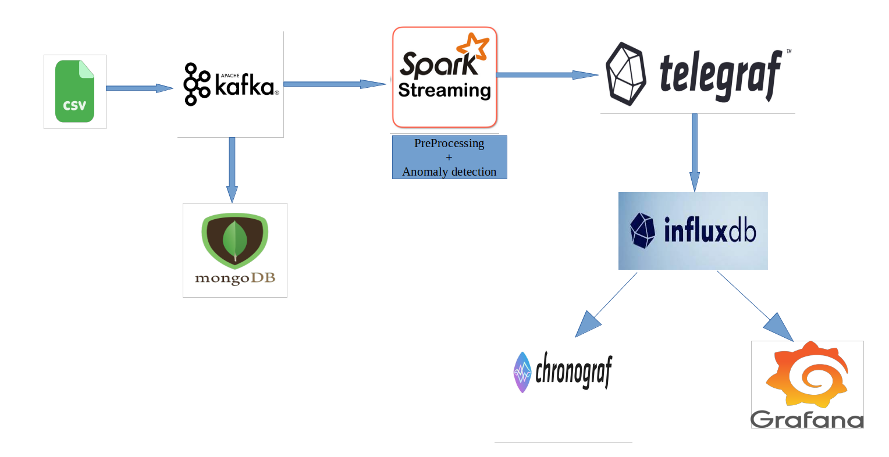

# Real-time Anomaly Detection System

## Overview
This system implements real-time anomaly detection using Kafka, Spark, Telegraf, InfluxDB, Grafana, and Chronograf. The entire process involves the following steps:

1. A Kafka Producer sends data from a CSV file to a Kafka topic for streaming.
2. A Spark session acts as a consumer and retrieves the data from the Kafka topic. Preprocessing steps are performed before applying pre-trained anomaly detection algorithms. An ensemble method is used to obtain the final output, which is then streamed to a different Kafka topic (Telegraf).
3. Telegraf collects data from the Kafka topic (Telegraf) and sends it to InfluxDB.
4. Grafana and Chronograf are connected to InfluxDB to create dashboards and anomaly alerts.

## Setup Steps
After cloning the GitHub repository, follow these steps:

1. Comment out the Telegraf container and the Telegraf dependency in Grafana and Chronograf.
2. Create empty folders for InfluxDB, Grafana, and Chronograf volumes (e.g., influx_data, grafana_data, chrono).
3. Run the Docker Compose file.
4. Create an InfluxDB token at http://localhost:8086/ and replace the token in the Telegraf configuration file.
5. Shut down all containers and remove comments from the Telegraf container and its dependency.
6. Change the path of the Telegraf configuration file in the Docker Compose file.
7. Save the changes in the Docker Compose file and run it again.
8. Create two topics in Kafka: telegraf and spark_stream at http://localhost:9000/.
9. Run the Spark notebook (spark2.ipynb) and the Kafka Producer notebook (adjust the data file path in kafka_producer.ipynb).
10. Connect Grafana to InfluxDB (choose Flux instead of InfluxQL in the query language) at http://localhost:3000/.
11. Connect to Chronograf at http://localhost:7070/.

## Diagram

